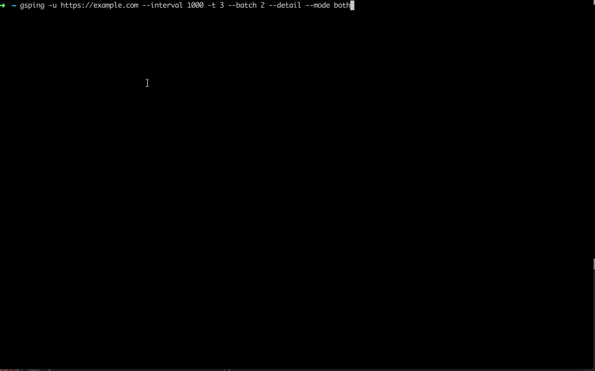

gsping
====================

One small tool to crawl website and get a simple performance report in the console.

> Small crawling tool for checking web performance

## install ##

```bash
npm install -g gsping
```

## Parameters ##

* **-v** show current running version.
* **-u** <url> to specify a url to test. it could be an array to provide a list of urls, in this case, everytime will get a batch count urls to crawl
* **-t** <number> to indicate how many times.
* **-m** to use mobile user agent.
* **--batch** <number> to set batch crawling count.
* **--existkey** <key> to check. This is keyword to check if it exists in response.
* **--regexp** when set --existkey, use this flag to indicate if it is a regular expression.
* **--interval** <number> in ms. To set crawling interval time in miliseconds.
* **--ua** <useragent> to indicate what ua you want to use. valid values: chrome(default), googlebot.
* **--detail** Show the result data for every crawling.
## Using config ##

```bash
gsping --config ./gsping.config.json
```

> example for json format.

```json
{
    "isMobile": false,
    "url": "https://www.google.com",
    "times": 1,
    "method": "GET",
    "ua": "googlebot",
    "existkey": "content=\"noodp\"",
    "regexp": true
}
```

## Usage ##

> example crawl google for 5 times.

```bash
gsping -u https://www.google.com -t 5
```

> example crawl google for 10 times, batch count 3 and interval 3s

```bash
gsping -u https://www.google.com -t 10 --batch 3 --interval 3000
```

> example crawl google with google mobile(-m) bot user agent

```bash
gsping -u https://www.google.com -t 5 -m --ua googlebot
```

> example checking some string existing in response

```zsh
gsping -u https://www.google.com -t 10 --existkey itemtype=\"http://schema.org/WebPage\" --detail
```

